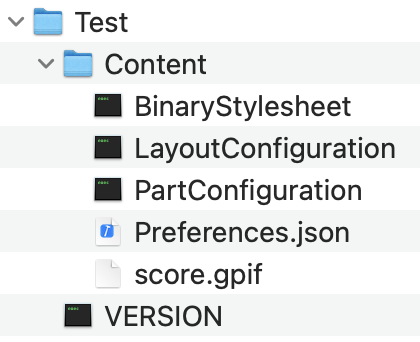

# music-notation-import-guitarpro

`music-notation` import code specific to Guitar Pro 8 files.

### Guitar Pro 8

Guitar Pro 8 is a zipped file format (`.gp`) which expands into a folder that has the following contents:

The `score.gpif` file is an application specific XML file.

The source files in the GuitarPro7 folder are those specific to parsing this file format.

`music-notation-import-guitarpro` supports specifying the `gpif` file alone, or specifying the container `gp` file. Using the [ZIPFoundation](https://github.com/weichsel/ZIPFoundation) the process will pull out the `score.gpif` file and parse that directly.

####

There are two folders of code in the Guitar Pro 7 parser. One contains the parsing code (XML to Swift structured data), the other contains extension to the `music-notation` library that adds initializers that understand the parse data from the XML file.

## Notes

This is (obviously) a work in progress. It is meant to drive and help develop the `music-notation` project. It is one of the packages used by [music-notation-import](https://github.com/music-notation-swift/music-notation-import)
