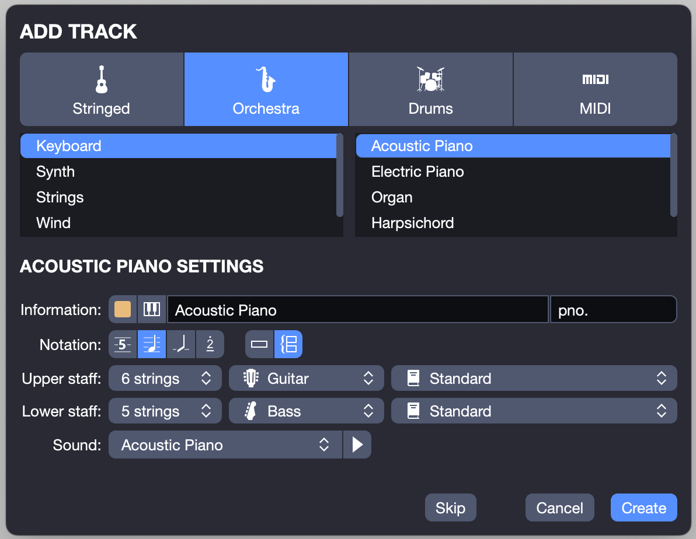
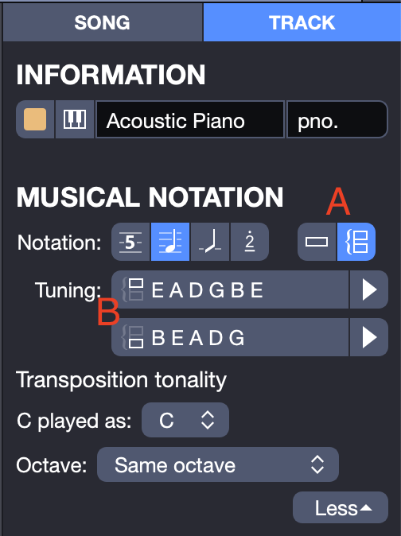

[](https://github.com/music-notation-swift/music-notation-import-guitarpro)


# music-notation-import-guitarpro

`music-notation` import code specific to Guitar Pro 8 files.

### Guitar Pro 8

Guitar Pro 8 is a zipped file format (`.gp`) which expands into a folder that has the following contents:


The `score.gpif` file is an application specific XML file.

The source files in the GuitarPro7 folder are those specific to parsing this file format.

`music-notation-import-guitarpro` supports specifying the `gpif` file alone, or specifying the container `gp` file. Using the [ZIPFoundation](https://github.com/weichsel/ZIPFoundation) the process will pull out the `score.gpif` file and parse that directly.

#### Staff Object

The Staff object which in the `score.gpif` is represented by

```XML
<Staves>
	<Staff></Staff>
	...
</Staves> 
```

seems to describe the tuning section of the new track dialog



You can see this reflected in the Track sidepanel of Guitar Pro in the Tuning section.



You can see in that screen snapshot that the staff indicator will tell you whether to expect one or two staves in the `<Staves>` section of the XML file.

- The notation staff kind (single or grand staff) interface, is labelled `A` in the picture above.
- The tuning section describes (in a guitar centric way) the tuning of the staves and can be found in the `property` of of each `<Staff>`

## Dependencies

- [SWXMLHash](https://github.com/drmohundro/SWXMLHash)

  Used to parse the XML data in the GuitarPro files.

- [ZIPFoundation](https://github.com/weichsel/ZIPFoundation)

  Used to find the XML file within the GuitarPro file (which is just a folder zipped with some files in it)

There are two main folders of code in the Guitar Pro 7 parser. One contains the parsing code (XML to Swift structured data), the other contains extension to the `music-notation` library that adds initializers that understand the parse data from the XML file.

## Notes

This is (obviously) a work in progress. It is meant to drive and help develop the `music-notation` project. It is one of the packages used by [music-notation-import](https://github.com/music-notation-swift/music-notation-import)
